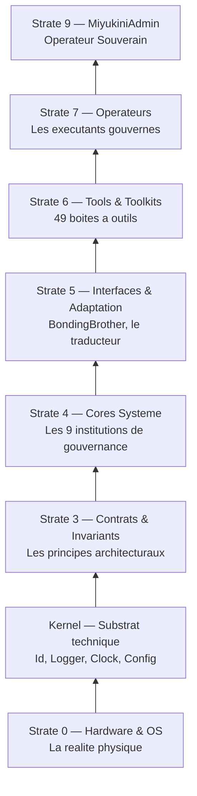
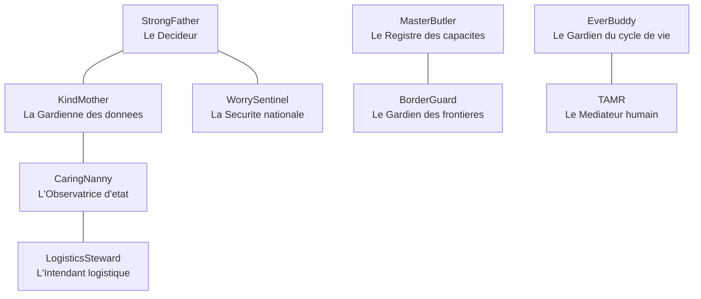
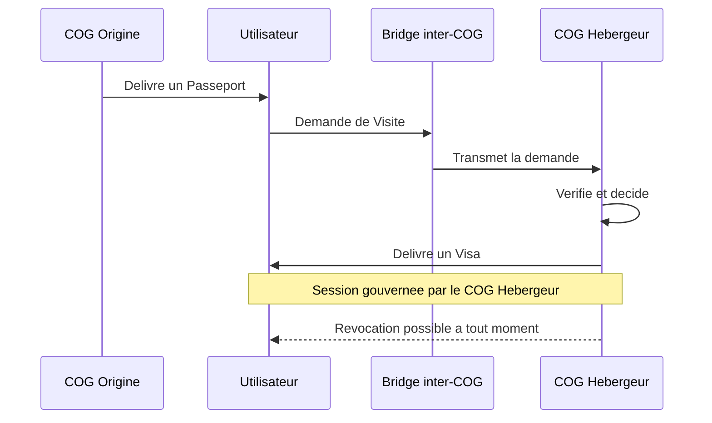
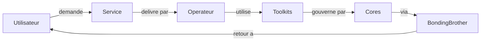
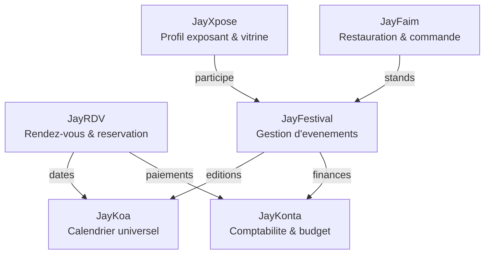
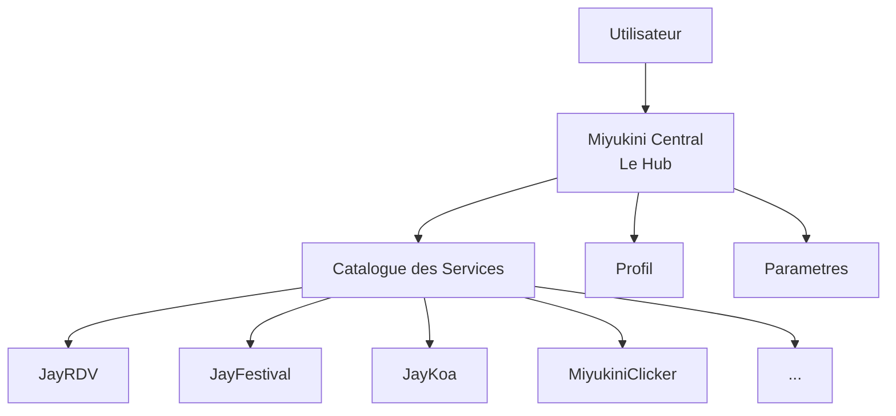

# Miyukini COG

> *"Miyukini is not an OS. It's the cog that makes digital systems work together."*

**Miyukini** est un **COG** — un **Core-Orchestrated Governance Environment**. Ce n'est pas un framework, pas une bibliotheque, pas un OS. C'est un **ecosysteme logiciel gouverne** : un environnement complet dans lequel des entites logicielles operent selon des regles strictes, des contrats verifiables, et une gouvernance centralisee — du noyau technique jusqu'a l'interface utilisateur.

---

## Sommaire

1. [La Philosophie — Pourquoi Miyukini existe](#1-la-philosophie--pourquoi-miyukini-existe)
2. [L'Ampleur du Projet — Ce qui est construit](#2-lampleur-du-projet--ce-qui-est-construit)
3. [Les Strates — Comment tout s'organise](#3-les-strates--comment-tout-sorganise)
4. [Les Mecanismes Inedits](#4-les-mecanismes-inedits)
5. [Les Toolkits — La boite a outils universelle](#5-les-toolkits--la-boite-a-outils-universelle)
6. [Les Operateurs — Les executants gouvernes](#6-les-operateurs--les-executants-gouvernes)
7. [Les Services — Ce que l'utilisateur voit](#7-les-services--ce-que-lutilisateur-voit)
8. [Miyukini Central — Le point d'entree](#8-miyukini-central--le-point-dentree)
9. [Services implementes](#9-services-implementes)
10. [Etat des lieux du projet](#10-etat-des-lieux-du-projet)
11. [Documentation de reference](#11-documentation-de-reference)
12. [Licence](#12-licence)

---

## 1. La Philosophie — Pourquoi Miyukini existe

### L'allegorie de la nation numerique

Imaginez que vous construisiez un **pays** — pas une maison, pas un quartier, mais un pays entier. Ce pays a besoin d'une constitution, d'institutions, de fonctionnaires, de lois, de frontieres, d'une diplomatie. Il doit pouvoir fonctionner **meme si toutes les routes sont coupees** : pas de panique, pas d'effondrement, juste un fonctionnement degrade mais ordonne.

C'est exactement ce que fait Miyukini. Sauf que le pays est numerique, la constitution est du code, et les citoyens sont des composants logiciels.

### Le probleme que Miyukini resout

Les logiciels modernes reposent sur des hypotheses fragiles : connexion permanente, cloud toujours disponible, services tiers accessibles. Quand une de ces hypotheses tombe, tout s'effondre.

Miyukini prend le probleme a l'envers :

> **La deconnexion n'est pas une erreur a corriger. C'est un etat normal du systeme.**

Un systeme Miyukini demarre sans reseau, fonctionne sans cloud, degrade proprement en isolation, reste administrable localement, et se reconcilie quand le reseau revient — sans reconstruction.

### Les 8 Lois d'Autonomie

Ces lois sont les **invariants non negociables** de l'ecosysteme. Rien ne peut les contredire :

| Loi | Enonce |
|-----|--------|
| **LOI-1** | Aucune dependance externe critique a l'execution |
| **LOI-2** | Le systeme accepte l'isolement comme etat normal |
| **LOI-3** | L'etat local est souverain |
| **LOI-4** | Pas de temps global requis |
| **LOI-5** | Le cout doit etre proportionnel au hardware |
| **LOI-6** | L'autonomie n'empeche pas la federation |
| **LOI-7** | La strate Cores est immuable — evolution par environnement |
| **LOI-8** | Migration = diplomatie entre environnements |

> Question de conception permanente : *"Est-ce que ca fonctionne encore si le systeme est seul, lent, et isole ?"*

Documentation : [Lois d'Autonomie](docs/public/Miyukini%20-%20Lois%20Autonomie%20Systeme.md)

### Ce n'est pas un exercice theorique

Miyukini est un **projet experimental a grande echelle**, ecrit en **Rust**, avec une application desktop native (egui/eframe) deja fonctionnelle. Ce n'est pas un whitepaper : c'est du code qui compile, des architectures qui tournent, des mecanismes qui s'executent.

---

## 2. L'Ampleur du Projet — Ce qui est construit

Pour donner une idee de l'echelle :

```
 9 Cores de gouvernance       (les institutions du systeme)
49 Toolkits implementes        (les outils professionnels)
10 Services documentes         (les services publics)
70+ crates Rust                (les modules de code)

1000+ pages de documentation conceptuelle
 244 analyses de marche (Odoo, etc.)
 Architecture complete en strates (de la couche 0 au sommet)
```

Ce n'est pas un prototype. C'est un **ecosysteme structurel** dont l'ambition est de remplacer les CMS, SaaS, et applications silotees par un environnement souverain, gouverne, et autonome.

---

## 3. Les Strates — Comment tout s'organise

### L'allegorie du batiment gouvernemental

Pensez a un batiment de gouvernement. Au sous-sol, les fondations et les canalisations (on n'y touche jamais). Au rez-de-chaussee, les archives et le compteur electrique. Aux etages intermediaires, les ministeres. Aux etages superieurs, les fonctionnaires qui recoivent le public. Et tout en haut, le bureau du president.

La **Pyramide Miyukini** fonctionne exactement ainsi :



**Regle fondamentale** : la dependance est strictement unidirectionnelle, du haut vers le bas. Une strate superieure peut utiliser ce qui est en dessous, mais jamais l'inverse.

| Strate | Allegorie | Role |
|--------|-----------|------|
| **0** | Le terrain | Hardware et OS — la realite physique |
| **K** | Les fondations | Kernel — identifiants, horloge, logs (zero logique metier) |
| **3** | Le reglement interieur | Contrats et invariants architecturaux |
| **4** | Les ministeres | 9 Cores qui gouvernent sans jamais executer |
| **5** | L'interprete officiel | BondingBrother traduit les intentions vers les Cores |
| **6** | La caisse a outils | 49 Toolkits — capacites executables et gouvernees |
| **7** | Les fonctionnaires | Operateurs — executent les services pour le compte de l'utilisateur |
| **9** | Le president | MiyukiniAdmin — autorite souveraine d'exception |

Documentation : [Pyramide Architecture](docs/public/Miyukini%20-%20Pyramide%20Architecture%20Complete.md)

---

## 4. Les Mecanismes Inedits

### 4.1 Les Cores — Les institutions qui gouvernent

Dans notre allegorie du pays, les **Cores** sont les **ministeres**. Chacun a un domaine exclusif, une autorite absolue dans ce domaine, mais **aucun pouvoir d'execution**. Ils decident, gouvernent, definissent — mais n'executent jamais.



| Core | Allegorie | Question fondamentale |
|------|-----------|----------------------|
| **StrongFather** | Le President | *"Devrait-on faire cette action ?"* |
| **KindMother** | La Gardienne des archives | *"Comment les donnees sont-elles persistees ?"* |
| **CaringNanny** | L'Infirmiere scolaire | *"Dans quel etat se trouve le systeme ?"* |
| **MasterButler** | Le Registre du cadastre | *"Qu'est-ce qui est possible dans cet environnement ?"* |
| **BorderGuard** | Le Douanier | *"Ou sont les frontieres et les regles de franchissement ?"* |
| **EverBuddy** | L'Archiviste des versions | *"Comment le systeme evolue-t-il sans se rompre ?"* |
| **WorrySentinel** | L'Agence de securite | *"Quel niveau de securite est applicable ?"* |
| **TAMR** | Le Mediateur citoyen | *"Quand l'humain a-t-il le droit d'intervenir ?"* |
| **LogisticsSteward** | L'Intendant | Gestion des ressources et logistique |

> **Regle d'or** : les Cores decident ou gouvernent, mais **n'executent jamais**.

### 4.2 Un COG — Une nation numerique souveraine

Un **COG** (Core-Orchestrated Governance Environment) n'est pas un simple programme qui tourne. C'est une **entite souveraine** — comme un pays avec sa constitution, ses frontieres et ses lois.

Chaque COG possede :
- **Une version figee de ses Cores** — sa constitution, immuable
- **Un identifiant unique** — son passeport d'Etat
- **Des frontieres strictes** — on ne rentre pas sans autorisation
- **Des Operateurs assujettis** — ses fonctionnaires, lies a ce COG uniquement

> **LOI-7** : *"La strate Cores est immuable. Toute evolution se fait par la creation d'un nouvel environnement complet."*

Pas de patch sauvage, pas de hotfix. Si le pays doit evoluer, on cree un nouveau pays complet, versionne et auditable.

**Trois niveaux d'identite :**
- **LSI** (Local Sovereign ID) — le COG se declare lui-meme (offline, totalement autonome)
- **VID** (Verified ID) — verifie par un registre global (connecte, federe)
- **WID** (Witnessed ID) — atteste par echange indirect (cle USB, QR, signature)

Documentation : [Definition COG](docs/public/Miyukini%20-%20Definition%20COG.md) | [Souverainete](docs/public/Miyukini%20-%20Souverainete%20Environnement.md)

### 4.3 Les protocoles Inter-COG — La diplomatie numerique

Comment deux pays souverains echangent-ils sans fusionner leurs gouvernements ? Par la **diplomatie**. C'est exactement ce que font les COG.



L'allegorie est limpide :
- **Passeport Utilisateur** — delivre par votre pays d'origine, prouve qui vous etes. **Ne donne aucun droit.**
- **Demande de Visite** — votre intention d'acceder a un pays etranger (quels services, quel usage)
- **Bridge inter-COG** — l'ambassade qui transporte les documents. **Ne fait jamais confiance, ne decide jamais, transporte uniquement.**
- **Visa de Connexion** — delivre par le pays d'accueil. Definit exactement ce que vous pouvez faire, pendant combien de temps, et a quel niveau de securite (S1 a S5)

> *"Un COG n'accueille jamais une gouvernance etrangere. Il n'accueille que des visiteurs, sous visa, dans un cadre qu'il definit seul."*

**Niveaux du Visa :**

| Niveau | Nom | Usage |
|--------|-----|-------|
| **S1** | Observation | Lecture seule, spectateur |
| **S2** | Interaction controlee | Formulaires, navigation |
| **S3** | Temps reel | Jeu, collaboration live |
| **S4** | Sensible | Administration, finance |
| **S5** | Critique | MiyukiniAdmin uniquement |

Documentation : [Connexion Inter-COG](docs/public/Miyukini%20-%20Connexion%20Inter-COG.md)

### 4.4 Le Webway — Le reseau de galaxies

Miyukini integre un systeme de **tracking et de participation** entre COG federes grace a deux Toolkits dedies :
- **MiyuWebwayTracker** — observe et cartographie les COG accessibles dans le reseau, sans jamais modifier l'etat
- **MiyuWebwayParticipant** — gere la participation active d'un COG au reseau federe (annonce, decouverte, synchronisation gouvernee)

Ces mecanismes permettent a un COG de **decouvrir d'autres COG**, de **proposer ses services**, et de **consommer des services distants** — le tout sous gouvernance stricte, sans jamais importer de logique etrangere.

---

## 5. Les Toolkits — La boite a outils universelle

### L'allegorie de l'atelier

Un **Toolkit** (Kit d'Outils), c'est comme un **coffre a outils professionnel**. Le coffre contient des outils (tournevis, cle, perceuse). Chaque outil fait une chose precise. Le coffre les organise pour qu'ils soient plus efficaces ensemble. Mais **le coffre ne decide jamais** quoi construire — c'est le travail du menuisier (l'Operateur).

> *"Un Outil fait, mais ne decide jamais."*

### 49 Toolkits implementes

Chaque Toolkit est une crate Rust, documentee (documentation fondatrice + contrats de gouvernance + reference des outils) :

| Domaine | Toolkits |
|---------|----------|
| **Donnees & Infra** | MiyuSQL, MiyuWeb, MiyuClock, MiyuLocale, MiyuValidate, MiyuExport, MiyuSearch, MiyuJobs |
| **Identite & Social** | MiyuAuth, MiyuProfile, MiyuContacts, MiyuSocialFeed, MiyuSocialMessaging, MiyuSocialProfile, MiyuSocialModeration, MiyuStory, MiyuDiscovery |
| **Contenu & Media** | MiyuCMS, MiyuMedia, MiyuText, MiyuWidgets, MiyuForum, MiyuPolls, MiyuFeeds, MiyuBookmarks, MiyuModerationForum, MiyuAntiSpam, MiyuPM |
| **Commerce & Finance** | MiyuStore, MiyuShipping, MiyuBooking, MiyuBilling, MiyuInvoice, MiyuExpense, MiyuTreasury |
| **Point de Vente** | MiyuPosSales, MiyuPosInventory, MiyuPosAnalytics, MiyuPosLoyalty, MiyuPosKitchen, MiyuPosPayment |
| **Comptabilite** | MiyuComptaLedger, MiyuComptaReports, MiyuDeclarations |
| **Organisation** | MiyuHR, MiyuCalc, MiyuNotify, MiyuBooking |
| **Federation** | MiyuWebwayParticipant, MiyuWebwayTracker |

Documentation : [Tools et Toolkits](docs/public/Miyukini%20-%20Tools%20et%20Toolkits.md)

---

## 6. Les Operateurs — Les executants gouvernes

### L'allegorie du fonctionnaire

Un **Operateur**, c'est comme un **fonctionnaire** dans notre pays numerique. Il execute un role precis pour le compte du citoyen (l'utilisateur). Mais contrairement a un freelance, il ne travaille jamais seul et sans cadre : il est **gouverne**, **mandate**, et **trace**.

> *"Dans Miyukini, les utilisateurs n'installent pas d'applications. Ils interagissent avec des Operateurs gouvernes qui executent des roles pour leur compte."*



**Types d'Operateurs :**

| Type | Role | Exemple |
|------|------|---------|
| **Operateur de Service** | Gere un domaine fonctionnel | CMS, Auth, Facturation |
| **Operateur d'Interface** | Expose les services a l'utilisateur | UI Web, App mobile |
| **Operateur de Domaine** | Exerce un metier precis | Blog, Catalogue, Forum |
| **Operateur d'Automatisation** | Agit automatiquement | Notifications, Planification |
| **Operateur Souverain** | Autorite systeme (exception) | MiyukiniAdmin uniquement |

**Collaboration mandatee** : les Operateurs ne collaborent jamais librement. Toute collaboration est encadree par un **Mandat de Permission** emis par StrongFather et un **Contrat d'Equipe** qui definit les flux, les types de donnees, et les niveaux de securite.

Documentation : [Operateurs et Terminologie](docs/public/Miyukini%20-%20Operators%20et%20Terminologie.md) | [Mandats et Equipes](docs/public/Miyukini%20-%20Mandats%20et%20Equipes%20Operators.md)

---

## 7. Les Services — Ce que l'utilisateur voit

Un **Service**, c'est ce que le citoyen percoit. Il ne voit pas les ministeres (Cores), pas les coffres a outils (Toolkits), pas les procedures internes (Mandats). Il voit : *"Je veux prendre un rendez-vous"*, *"Je veux gerer mon festival"*, *"Je veux tenir ma comptabilite"*.

### La Famille Jay — Services interconnectes

Les services **Jay** sont concus pour **s'inter-polariser** : ils se couplent naturellement les uns aux autres, tout en restant independants.



| Service | Description |
|---------|-------------|
| **JayRDV** | Prise de rendez-vous et reservation en ligne (B2B2C). Creneaux, calendriers, confirmations, rappels. |
| **JayFestival** | Gestion d'evenements et festivals. Catalogue, dashboard exposant, agenda visiteur, billetterie. |
| **JayKoa** | Calendrier universel du COG. Agregue les dates de tous les services, detecte les conflits, exporte (iCal, PDF). |
| **JayKonta** | Comptabilite et budget multi-echelle. Du budget perso (JayBudget) a la comptabilite entreprise. |
| **JayXpose** | Profil exposant et site vitrine pour artisans, artistes, petites marques. S'integre dans JayFestival. |
| **JayFaim** | Reservation de tables et commande en ligne. Restaurants, traiteurs, food trucks. Se couple avec JayFestival. |

### Les Services Miyukini

| Service | Description |
|---------|-------------|
| **MiyukiniCentral** | Le Hub — point d'entree unique vers tous les services du COG |
| **MiyukiniClicker** | Jeu officiel idle/clicker + strategie. Demo de coexistence multi-services dans un COG |
| **MiyukiniSurvivor** | Jeu hybride Survivor + Tower Defense. Phase preparation, phase bataille, tours et chateau |
| **MiyukiniSales** | Ventes et devis : cycle complet devis → commandes → facturation → paiements |

---

## 8. Miyukini Central — Le point d'entree

### L'allegorie de la Mairie

**Miyukini Central**, c'est la **Mairie** de notre pays numerique. C'est la ou le citoyen se rend pour acceder aux services publics. La Mairie ne fournit pas les services elle-meme — elle les **repertorie**, les **presente**, et **oriente** le citoyen vers le bon guichet.



**Miyukini Central est une application desktop native** (egui/eframe, pur Rust) qui offre :
- Un **ecran de chargement** avec progression et phrases aleatoires
- Un **Hub** avec catalogue des services disponibles (grille ou liste)
- Une **sidebar** de recherche et filtres (categories, types)
- Des **cartes de services** avec nom, description et bouton d'ouverture
- Un systeme d'**onglets** (Hub + services ouverts)
- Des overlays **Profil** et **Parametres** (theme clair/sombre persistant)

> Miyukini Central **ne decide jamais**. Il traduit les intentions de l'utilisateur vers les Cores via BondingBrother.

---

## 9. Services implementes

### Etat d'implementation

| Couche | Composant | Statut |
|--------|-----------|--------|
| **Kernel** | miyukini-kernel | Implemente |
| **Cores** (x9) | strongfather, kindmother, caringnanny, masterbutler, borderguard, everbuddy, worrysentinel, tamr, logisticssteward | Implementes |
| **Toolkits** (x49) | Tous les MiyuXxx | Phase 1 (squelettes) complete, Phase 2 (logique) en cours |
| **Miyukini Central** | Hub desktop (egui) | Fonctionnel |
| **JayKoa** | Calendrier universel | Implemente (crate + UI) |
| **JayFestival** | Gestion evenements | Implemente (crate) |
| **MiyukiniClicker** | Jeu idle/clicker | Implemente (crate) |
| **MiyukiniSurvivor** | Jeu survivor/TD | Implemente (crate lord_of_the_castle) |
| **MiyukiniAdmin** | Console admin | Implemente (crate + UI web) |
| **JayRDV, JayKonta, JayXpose, JayFaim, MiyukiniSales** | Services documentes | Phase conceptuelle (documentation complete, pas encore de crate) |

### Prochaine phase

Le travail se deplace vers l'**implementation des Operateurs** (Strate 7). Les Operateurs orchestreront les 49 Toolkits deja implementes — seuls ou en equipes — pour delivrer les services aux utilisateurs, sous gouvernance (StrongFather, Mandats de Permission, Contrats d'equipe).

---

## 10. Etat des lieux du projet

### Ce qui est stabilise

- La **Pyramide**, les **Cores**, les **Lois d'autonomie** et les **contrats de gouvernance** sont documentes et stabilises
- Le **Kernel** et les **9 Cores** sont implementes comme crates Rust
- Les **49 Toolkits** sont implementes (squelettes complets, logique progressive)
- **Miyukini Central** (Hub desktop) est fonctionnel
- **1000+ pages** de documentation conceptuelle couvrant l'ensemble de l'architecture
- **244 analyses de marche** (dont une etude exhaustive d'Odoo module par module)
- Systeme de **balisage semantique** (MSCM) et d'**indexation structurelle** (MIP) operationnel

### Ce qui est en cours

- Implementation progressive de la logique metier dans les Toolkits (Phase 2)
- Conception produit des services Jay (JayRDV, JayFestival, JayKonta, JayXpose, JayFaim)
- Specification des besoins en Operateurs pour chaque service

### Ce qui reste a faire

- Implementation des **Operateurs** (Strate 7) — la couche qui orchestre les Toolkits pour delivrer les services
- **Federation inter-COG** — les protocoles sont documentes, l'implementation est a venir
- **Webway** — le reseau de decouverte et federation entre COG

### Maturite du projet

```
Documentation conceptuelle    ████████████████████  95%
Architecture (Pyramide/Cores) ████████████████████  95%
Kernel                        ██████████████████░░  90%
Toolkits (49 crates)          ████████████░░░░░░░░  60%
Services (conception)         ████████████░░░░░░░░  55%
Miyukini Central (Hub)        ██████████████░░░░░░  70%
Operateurs (implementation)   ████░░░░░░░░░░░░░░░░  15%
Federation inter-COG          ██░░░░░░░░░░░░░░░░░░  10%
```

---

## 11. Documentation de reference

### Documentation publique

Toute la documentation conceptuelle de reference est disponible dans le dossier `docs/public/` :

| Theme | Document |
|-------|----------|
| **Dictionnaire officiel** | [Glossaire](docs/public/Miyukini%20-%20Glossaire.md) |
| **Qu'est-ce qu'un COG** | [Definition COG](docs/public/Miyukini%20-%20Definition%20COG.md) |
| **Architecture en strates** | [Pyramide Architecture](docs/public/Miyukini%20-%20Pyramide%20Architecture%20Complete.md) |
| **Lois fondamentales** | [Lois d'Autonomie](docs/public/Miyukini%20-%20Lois%20Autonomie%20Systeme.md) |
| **Vision et strategie** | [Vision Strategique](docs/public/Miyukini%20-%20Vision%20Strategique.md) |
| **Objectif du projet** | [Objectif Final](docs/public/Miyukini%20-%20Objectif%20Final.md) |
| **Souverainete des environnements** | [Souverainete](docs/public/Miyukini%20-%20Souverainete%20Environnement.md) |
| **Les Operateurs** | [Operateurs et Terminologie](docs/public/Miyukini%20-%20Operators%20et%20Terminologie.md) |
| **Les outils** | [Tools et Toolkits](docs/public/Miyukini%20-%20Tools%20et%20Toolkits.md) |
| **Collaboration gouvernee** | [Mandats et Equipes](docs/public/Miyukini%20-%20Mandats%20et%20Equipes%20Operators.md) |
| **Echanges entre COG** | [Connexion Inter-COG](docs/public/Miyukini%20-%20Connexion%20Inter-COG.md) |
| **Maintenance Kernel** | [Kernel Maintenance](docs/public/Miyukini%20-%20Kernel%20Maintenance%20Observability%20Contract.md) |

### Pour aller plus loin (repo prive)

| Theme | Emplacement |
|-------|-------------|
| Index des Toolkits | `docs/tools/_index.md` |
| Documentation des Services | `docs/services/` |
| Documentation des Cores | `docs/cores/` |
| Analyses de marche | `docs/market/` |
| Securite | `docs/security/` |

---

## 12. Licence

Miyukini est distribue sous une **politique de licence duale** :

- **Usage domestique / personnel** (personne physique, fins non commerciales) : **gratuit** — voir [LICENSE](LICENSE)
- **Usage par une societe ou une collectivite** (entreprise, association, administration) : **licence commerciale requise**

Details : [Miyukini — Politique de licence](docs/legal/Miyukini%20-%20Politique%20de%20Licence.md)

---

> *"Miyukini n'est pas une bibliotheque. C'est un environnement gouverne dans lequel des Operateurs operent."*

**Derniere mise a jour** : 2026-02-07
